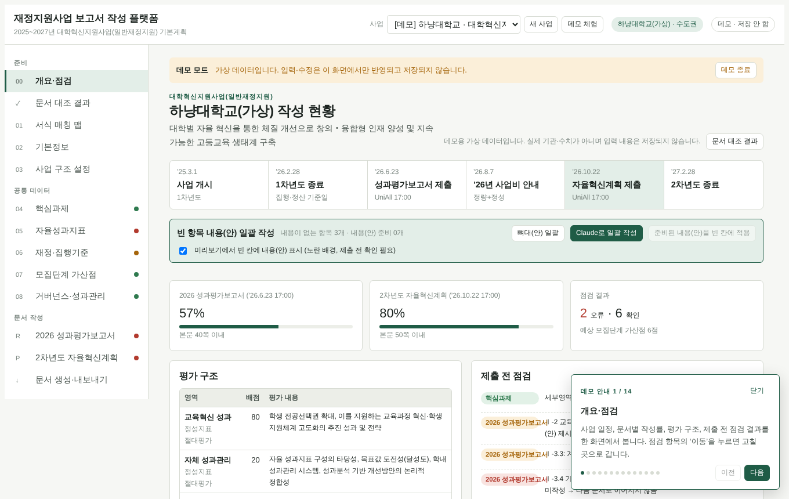
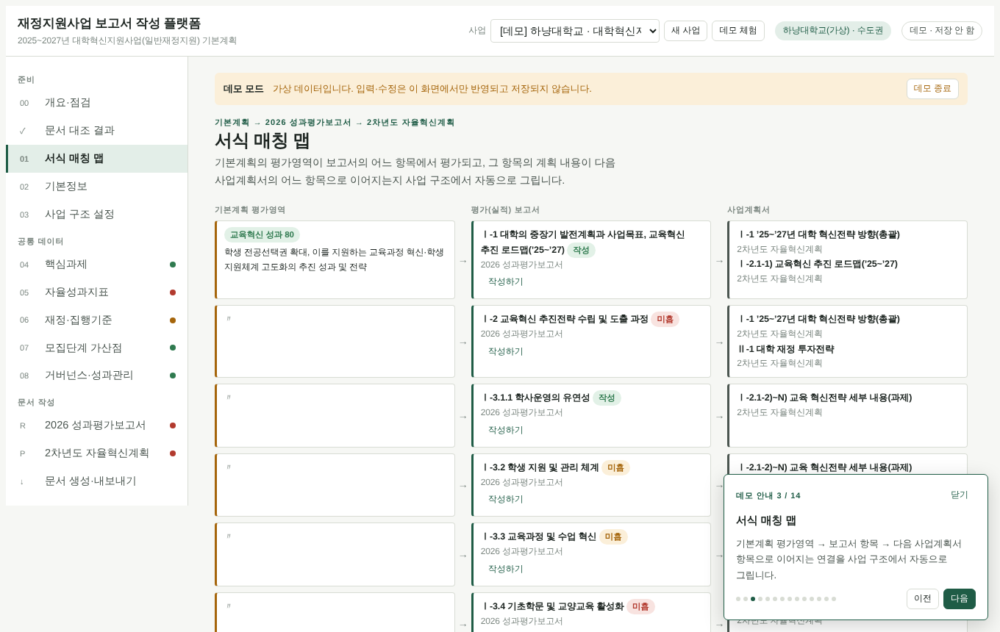
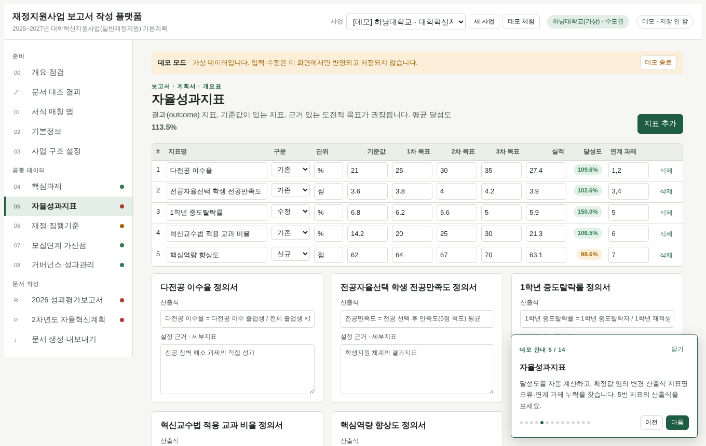
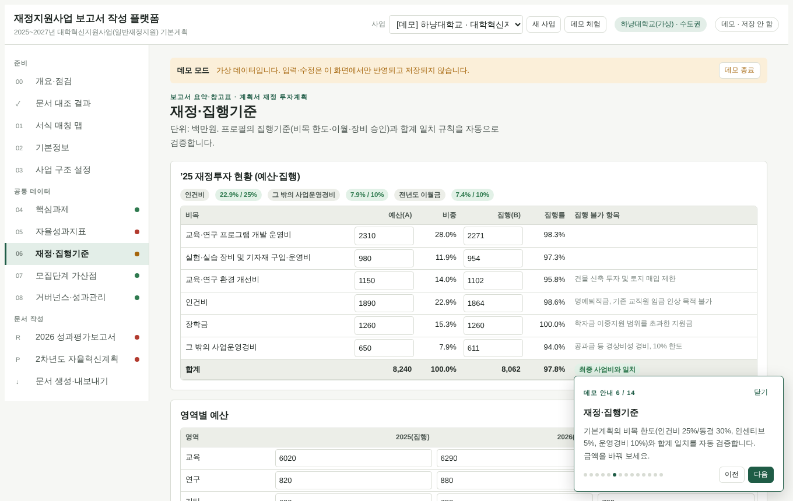
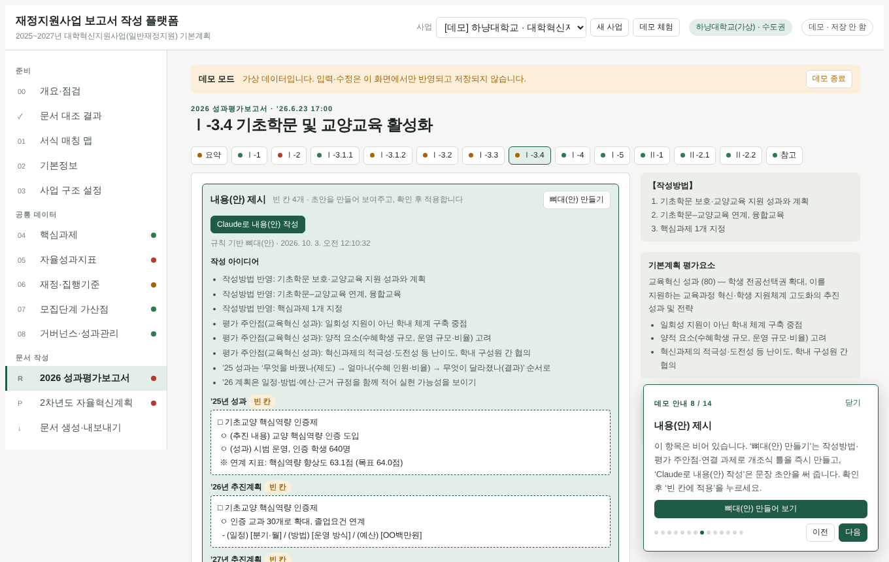
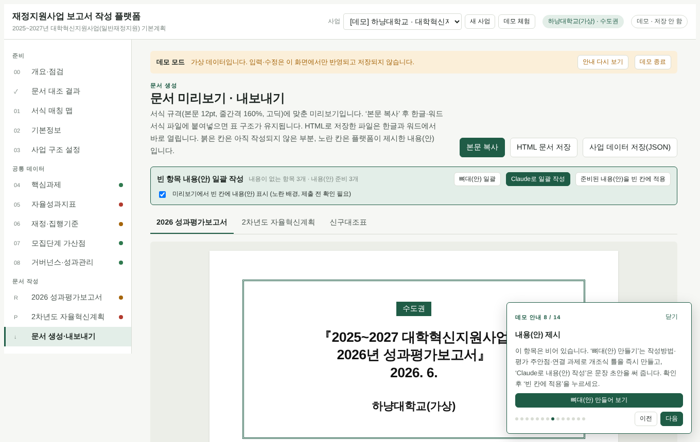
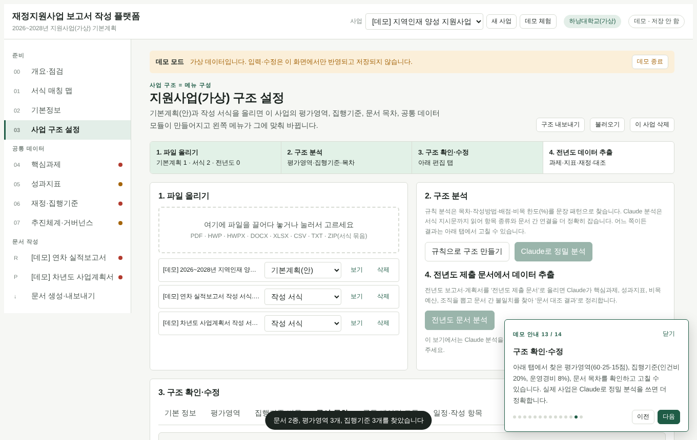

# Platform for Project Reports — 재정지원사업 보고서 작성 플랫폼

정부 재정지원사업의 **기본계획(안)과 작성 서식**을 올리면 사업 구조(평가영역·배점, 사업비 집행기준, 문서 목차·작성방법, 문서 간 연결)를 만들고, 그 구조에 맞춰 **준비 · 공통 데이터 · 문서 작성** 메뉴를 자동으로 구성하는 단일 HTML 플랫폼입니다. 초기 보고서 작성 단계에서 빈 항목에 **작성 아이디어와 내용(안)**을 제시합니다.

## ▶ 데모 바로 보기

**[데모 열기](https://YOUR-ID.github.io/Platform-for-Project-Reports/#demo)** — GitHub Pages를 켠 뒤 `YOUR-ID`를 내 GitHub 아이디로 바꿔 주세요.

- 처음 방문하면(저장된 사업이 없으면) 데모가 자동으로 시작되고, 오른쪽 아래 안내창이 14단계로 화면을 옮겨 가며 설명합니다.
- 주소 끝에 `#demo`를 붙이면 언제든 데모로 시작합니다.
- 데모는 가상 대학(하냥대학교) 데이터이며, 데모에서 입력한 내용은 저장되지 않습니다. **데모 종료**를 누르면 내 사업을 만들 수 있습니다.

| 개요·점검 | 서식 매칭 맵 |
|---|---|
|  |  |
| **성과지표 자동 점검** | **재정·집행기준 검증** |
|  |  |
| **빈 항목 내용(안) 제시** | **문서 미리보기 (노란 칸 = 내용(안))** |
|  |  |
| **다른 사업: 서식 파일로 구조 만들기** | |
|  | |

## GitHub Pages로 공개하기

1. GitHub에서 새 저장소(예: `Platform-for-Project-Reports`)를 만들고, 이 폴더의 내용을 그대로 올립니다(`index.html`이 저장소 맨 위에 있어야 합니다).
2. 저장소 **Settings → Pages → Build and deployment**에서 Source를 **Deploy from a branch**, Branch를 **main / (root)**로 저장합니다.
3. 1~2분 뒤 `https://내아이디.github.io/Platform-for-Project-Reports/`가 열립니다. 데모로 바로 가는 주소는 끝에 `#demo`를 붙입니다.
4. 위 ‘데모 열기’ 링크의 `YOUR-ID`를 내 아이디로 바꿔 커밋합니다.

`.nojekyll` 파일은 GitHub Pages가 파일을 가공하지 않고 그대로 내보내도록 넣어 둔 것입니다.

## 내 PC에서 실행

- `index.html`을 브라우저(Chrome·Edge 권장)로 엽니다. 설치가 필요 없습니다.
- 처음 열면 데모가 시작됩니다. 위쪽 **데모 체험** 버튼으로 언제든 다시 볼 수 있습니다.

## 주요 기능

| 구분 | 내용 |
|---|---|
| 파일 해석 | PDF · HWP · HWPX · DOCX · XLSX/CSV · TXT · ZIP(서식 묶음) 을 브라우저에서 직접 읽음 |
| 사업 구조 만들기 | 규칙 분석(목차·작성방법·배점·비목 한도 % 패턴), Claude 정밀 분석(claude.ai 아티팩트에서 실행 시) |
| 매칭 맵 | 기본계획 평가영역 → 평가(실적)보고서 항목 → 차년도 사업계획서 항목 연결을 자동으로 그림 |
| 공통 데이터 | 핵심과제, 성과지표(달성도 자동 계산), 재정(비목 한도·합계·이월·장비 승인), 가산점, 거버넌스 — 한 번 입력하면 여러 문서 표에 반영 |
| 점검 | 과제 지정 개수, 확정값 임의 변경, 산출식 지표명 오류, 비목 편중, 필수 위원 구성, 분량 등 |
| 내용(안) 제시 | 빈 항목에 뼈대(안)(오프라인) 또는 Claude 내용(안) 작성, 확인 후 적용, 빈 항목 일괄 작성 |
| 문서 생성 | 서식 규격(12pt·줄간격 160%·고딕) 미리보기, 본문 복사(한글·워드 붙여넣기), HTML 저장, 신구대조표 |
| 내장 템플릿 | 2025~2027 대학혁신지원사업(일반재정지원) |

## 실행 환경별 차이

| 기능 | 로컬 파일 / GitHub Pages | claude.ai 아티팩트 |
|---|---|---|
| 데이터 저장 | 브라우저 저장소(localStorage, 그 PC·브라우저에만) | 아티팩트 공유 저장소 |
| Claude 분석·내용(안) | 사용 불가(뼈대(안)·규칙 분석은 사용 가능) | 사용 가능(보는 사람의 Claude 사용량) |
| 파일 저장 | 브라우저 다운로드 | 저장 확인 창 |
| 파일 해석 라이브러리 | cdnjs에서 필요할 때 불러옴(인터넷 필요) | 동일 |

다른 PC로 옮길 때는 **문서 생성 → 사업 데이터 저장(JSON)** 후 새 환경에서 **사업 구조 설정 → 불러오기**를 사용합니다.

## 폴더 구조

```
index.html          빌드된 실행 파일 (이 파일 하나로 동작)
src/
  01.layout.html    제목·글꼴·스타일(색상 토큰, 라이트/다크)·화면 뼈대
  02.template.js    내장 사업 템플릿(사업 프로필 스키마 예시)
  03.demo.js        데모 데이터·체험용 예시 원문·안내 투어
  04.core.js        유틸, 저장소(db/로컬), 파일 해석, 규칙·Claude 분석, 계산·점검, 문서 생성
  05.draft.js       내용(안) 제시(뼈대·Claude·일괄)
  06.views.js       화면(메뉴는 사업 프로필로 구성)
  07.events.js      이벤트·시작
tools/build.js      src → index.html 결합
docs/screenshots/   README용 데모 화면
.nojekyll           GitHub Pages 원본 그대로 배포
data/               기관별 내보내기 JSON 보관 위치(.gitignore로 업로드 제외)
```

## 수정 후 다시 만들기

```bash
node tools/build.js      # 또는 npm run build
npm run check            # 빌드 + 스크립트 문법 검사
```

`src/`의 파일은 이름 순서대로 합쳐집니다. 새 사업 템플릿은 `02.template.js`의 `TEMPLATES`에 프로필 객체를 추가하면 시작 화면에 나타납니다.

## 사업 프로필(구조) 요약

```js
{
  programName, planTitle, goal, period, orgLabel, years:{prev,cur,next},
  variantLabel, variants:[...],                 // 예: 권역
  evalAreas:[{id,name,pts,how,desc,focus:[],bonus}],
  rules:[{id,label,kw,max,altMax,altLabel,type:"limit|carry"}],   // 비목 한도
  budgetItems:[...], budgetPlanItems:[...], budgetAreas:[...], equipThreshold,
  modules:{ tasks:{on,label,groups:[{area,sec,n,variant}]}, kpi:{on,label,min,max},
            finance:{on,label}, gov:{on,label,required:[{match,must,label}]}, bonus:{...} },
  docs:[{id,type:"report|plan",name,due,pageLimit,cover:[],
         sections:[{id,no,title,kind:"head|text|pp|auto|derived",src,group,keys,evalArea,guide:[],from:["문서id:항목id"]}]}],
  schedule:[{d,w,s}], ppFields:[{k,l,short}]
}
```

## 유의사항

- 배포용(암호화) HWP와 일부 구형 HWP는 읽지 못합니다. 한글에서 HWPX 또는 PDF로 저장해 올려 주세요. 스캔 이미지 PDF는 글자를 읽지 못합니다.
- 내용(안)은 초기 작성 보조용입니다. 제출 전 수치·사실은 원자료로 확인하고, 생성형 AI를 쓴 경우 서식 안내에 따라 사용 내역을 각주로 적어 주세요.
- 기관 실데이터 JSON은 공개 저장소에 올리지 않도록 `.gitignore`에 제외해 두었습니다.
